# Дружественные числа. Исследование

### #Занимательная Математика

#### Весь код на Github, ссылка в конце статьи!

Импорт библиотек


```python
from IPython.display import Image
from IPython.core.display import HTML 
from IPython.core.interactiveshell import InteractiveShell
from scipy.ndimage.filters import gaussian_filter1d
from scipy.signal import savgol_filter
import numpy as np
import sympy as sp
import pandas as pd
import random as r
import time
import matplotlib.pyplot as plt
import ipyturtle as turtle
InteractiveShell.ast_node_interactivity = "all"

def drawPlot(ss,title="Скорости",y="Секунд",x="Номер итерации"):
    fig,ax=plt.subplots(figsize=(6,6))
    ax.set_facecolor("#F2F2F2")
    ax.grid()
    ax.set_title(title)
    ax.set_ylabel(y)
    ax.set_xlabel(x)
    ax.plot(ss)
```


```python
Image(url="#", width=400)
```


Хммм. Что же такое дружественные числа?  

Посмотрим на примере:
Есть число 220. И есть число 284. Так вот. Они - друзья.

Почему? Как определить дружественные числа?
Дружественные числа - это такая пара, у которой сумма собственных делителей каждого числа равна другому числу.  

Посмотрим на практике. Создадим функцию поиска делителей, а потом просуммируем.


```python
def Divisors(num): 
    from math import sqrt as mmsq
    s=set([1])
    i=1
    a=int(mmsq(num)+1)
    while i<=a: 
        if(num//i==num):
            i+=1
            continue
        if (num%i==0): 
            if (num//i!=i): 
                s.add(num//i)
            s.add(i)
        i+=1
    return s
```


```python
Divisors(220)," #Делители числа 220"
Divisors(284)," #Делители числа 284"
```


    ({1, 2, 4, 5, 10, 11, 20, 22, 44, 55, 110}, ' #Делители числа 220')


    ({1, 2, 4, 71, 142}, ' #Делители числа 284')


1+2+4 = 6 Верно? Продолжим прибавлять..  
1+2+4+5+10+11+20+22+44+55+110   

Ну, или зачем вручную. Для подсчёта суммы любого множества(списка) есть готовая функция **sum()**


```python
sum(Divisors(220))
sum(Divisors(284))
```


    284


    220


И что мы наблюдаем? Сумма собственных делителей у 220 равна 284, а у числа 284 сумма - 220  
Поэтому эти числа и являются парой друзей :)


```python
Image(url="https://wikimedia.org/api/rest_v1/media/math/render/svg/f5f9a3fcecf20f39301b0f651492c3fbe712262d")
```


```python
Image(url="https://wikimedia.org/api/rest_v1/media/math/render/svg/4c5a454d5e4adb6fb2e7e3e467e0804e28d01824")
```


А ещё кстати говоря, эта пара является первой из всего списка дружественных чисел!

Кстати интересный факт, но хоть нам и известно уже огромное количество таких пар, мы не знаем есть ли такая пара, у которой числа были разной чётности. Вот например 220 и 284 чётные...Есть числа, где первое и второе нечётные, но чтобы один чётный, другой нечётный, такого мы не знаем ещё.

А вот возникает наверное вопрос. Как находить эти пары?  
Конкретной формулы пока ещё нет для этих чисел, поэтому я создал итерационную фунцию.  

Для этого я создал функцию **AmicableNumber()**, которая на вход принимает какое-либо число. В самой функции алгоритм находит друга, если он есть на ближайшей дистанции по числовой оси.


```python
def AmicableNumber(k,returni=False):  
    allDels = dict()
    from itertools import chain
    concatenated = chain( range(k, int(k*1.6)+1 ),range(k, int(k/1.6)+1 ,-1) )
    for i in concatenated:
        if(str(i) not in allDels):
            allDels[str(i)] = Divisors(i)
        if(i != k and sum(allDels[str(i)]) == k and sum(allDels[str(k)]) == i):
            if(returni):
                return (k,i)
            else:
                print(k,"->",i)  
```


```python
AmicableNumber(1) #Например тут ответа нет
AmicableNumber(219) #Например тут ответа нет
AmicableNumber(220) #А тут уже есть
```

    220 -> 284


Если не понятно, что я имел в виду под "дистанциями", то объясню.  Для начала нам нужно найти хотя-бы 5 пар дружественных чисел. 


```python
AmicableNumbers=[]
i=0
while len(AmicableNumbers)!=10:
    i+=1
    amn=AmicableNumber(i,True)
    if(amn is not None):
        AmicableNumbers.append(amn)
    
AmicableNumbers=[{tuple(sorted(amn)) for amn in AmicableNumbers}]
print(AmicableNumbers)
```

    [{(1184, 1210), (220, 284), (5020, 5564), (6232, 6368), (2620, 2924)}]


Решил найти только первые 5 пар, потому что таким алгоритмом всё это вычисляется примерно 10 минут.  
А как он работает?

Мы просто перебираем относительно заданного числа x в интервале x/1.6 -> 1.6x  
Это значительно ускоряет программу, но всё ещё недостаточно.  
Вопрос, почему именно такие цифры?

Показываю. Возьмём первые 10 пар дружественных чисел, а потом составим вектор из отношений чисел в парах.


```python
df=pd.DataFrame([(220,284),(1184,1210),(2620,2924),(5020,5564),(6232,6368),(10744,10856),(12285,14595),(17296,18416),(63020,76084),(66928,66992)])
df
```


<div>
<style scoped>
    .dataframe tbody tr th:only-of-type {
        vertical-align: middle;
    }

    .dataframe tbody tr th {
        vertical-align: top;
    }

    .dataframe thead th {
        text-align: right;
    }
</style>
<table border="1" class="dataframe">
  <thead>
    <tr style="text-align: right;">
      <th></th>
      <th>0</th>
      <th>1</th>
    </tr>
  </thead>
  <tbody>
    <tr>
      <th>0</th>
      <td>220</td>
      <td>284</td>
    </tr>
    <tr>
      <th>1</th>
      <td>1184</td>
      <td>1210</td>
    </tr>
    <tr>
      <th>2</th>
      <td>2620</td>
      <td>2924</td>
    </tr>
    <tr>
      <th>3</th>
      <td>5020</td>
      <td>5564</td>
    </tr>
    <tr>
      <th>4</th>
      <td>6232</td>
      <td>6368</td>
    </tr>
    <tr>
      <th>5</th>
      <td>10744</td>
      <td>10856</td>
    </tr>
    <tr>
      <th>6</th>
      <td>12285</td>
      <td>14595</td>
    </tr>
    <tr>
      <th>7</th>
      <td>17296</td>
      <td>18416</td>
    </tr>
    <tr>
      <th>8</th>
      <td>63020</td>
      <td>76084</td>
    </tr>
    <tr>
      <th>9</th>
      <td>66928</td>
      <td>66992</td>
    </tr>
  </tbody>
</table>
</div>


```python
ratio=[i[1]/i[0] for i in df.to_numpy()]
drawPlot(ratio,title="Отношения пар",x="Номер пары",y="Отношение")
```


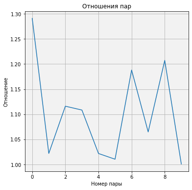


На данном графике мы видим по оси Х номер пары, а на оси У отношение большего числа в паре к меньшему.
Это своего рода расстояние от 1 до другого числа.  
То, есть 220 умножить на 1.29, мы получим 284. Нет смысла искать пару этому числу, если умножать больше чем на 1.29  

У другого числа расстояние до его пары вообще близкое.   
В целом среднее соотношение пар


```python
np.mean(ratio)
```


    1.1030557457540984


Кстати, раз уж мы заговорили про соотношения, попробуем составить числовую последовательность из дружественных чисел  
А затем найдём соотношения чисел к предыдущим в таком ряду.


```python
seq=df.to_numpy().flatten()
seq #Собственно первые 20 чисел последовательности (10 пар)
```


    array([  220,   284,  1184,  1210,  2620,  2924,  5020,  5564,  6232,
            6368, 10744, 10856, 12285, 14595, 17296, 18416, 63020, 76084,
           66928, 66992])


```python
drawPlot(seq,title="Последовательность",x="Номер числа",y="Число")
```


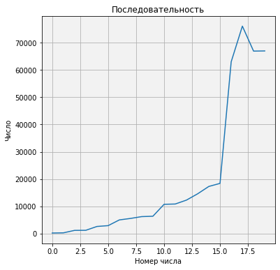


Для начала я показал график, где мы видим как изменяется число со временем во всей последовательности.


```python
ratio = [seq[i]/seq[i-1] for i in range(1,len(seq))]
drawPlot(ratio,title="Отношение чисел",x="Номер числа",y="Отношение")
```


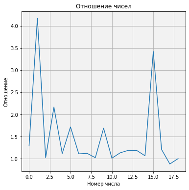


Вот пожалуйста, мы видим, что отношения чисел во всей последовательности отличаются от отношений чисел внутри пар!

Найдём производную графика. Да, ряд не сходится, но мы можем узнать скорость изменения отношений. 


```python
dratio = [ratio[i]-ratio[i-1] for i in range(1,len(ratio))]
drawPlot(dratio,title="Скорость отношений чисел",x="Отношение",y="Скорость")
```


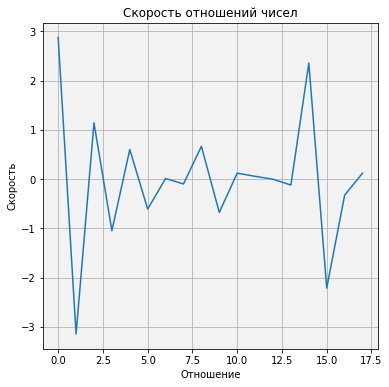


А ускорение?)


```python
ddratio = [dratio[i]-dratio[i-1] for i in range(1,len(dratio))]
drawPlot(ddratio,title="Ускорение отношений чисел",x="Скорость",y="Ускорение")
```


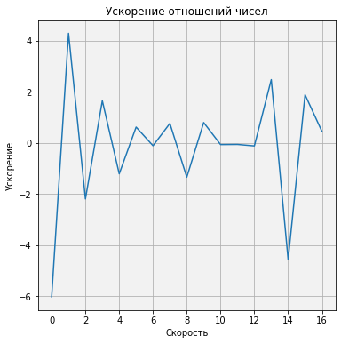


В целом не изменилось особо. Ах..мы это исследовали графики соотношений чисел!  
Сделаем тоже самое с самой последовательностью.   
Так мы узнаем, похожи ли графики.  
  
Кстати, скорость ряда -    
Другими словами это будет расстояние в единицах от 1 элемента ряда до другого.


```python
dseq = [seq[i]-seq[i-1] for i in range(1,len(seq))]
drawPlot(dseq,title="Дистанции между числами",x="Номер числа",y="Отношение")
```


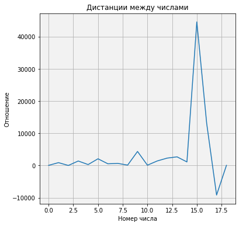


Ого, скорость вроде нарастает, но что же интересно со следующими парами в дружественных числах?  
Узнаем ускорение


```python
ddseq = [dseq[i]-dseq[i-1] for i in range(1,len(dseq))]
drawPlot(ddseq,title="Ускорение дружественных чисел",x="Номер числа",y="Ускорение")
```


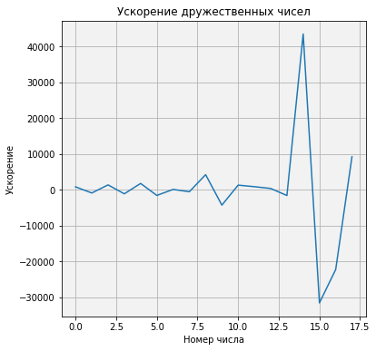


Графики скорости и ускорения чисел не похожи на то же у их соотношений, но мы замечаем другое!  
Не зная все следующие пары чисел после 11, мы можем предполагать, что скорость и ускорение начинают увеличиваться.  

В принципе неудивительно.   
Если мы вспомним график самого ряда, то заметим, что числа очень сильно увеличиваются со временем.

#### Плотность   
Если вы читали предыдущую мою статью про числа Фибоначчи, то вы уже знаете про плотность последовательности.  

Предлагаю исследовать и ряд дружественных чисел на это свойство! +Скорость изменения плотности!)


```python
densities=[(len(list(filter(lambda x: x < i, sorted(seq))))-1)/i for i in range(200,10000)]
drawPlot(densities,"Изменение плотности","Плотность","Дружественное число")
```


Ого! Неожиданно. Плотность вроде увеличивается, а потом уменьшается.  
Причём, у вас, дорогие читатели, есть возможность поучаствовать в моём исследовании.   
Сможете вычислить тангенс угла между проекциями на оХ скачков и осью оХ ?


```python
ddensities = [densities[i]-densities[i-1] for i in range(1,len(densities))]
drawPlot(ddensities,title="Скорость плотности",x="Дружественное число",y="Скорсоть")
```


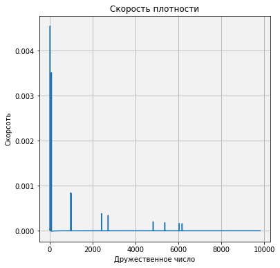


Ну, значит в целом стремится к нулю, что неудивительно. Ведь числа значительно увеличиваются со временем, а также значительно увеличивается их дистанция от одной пары до другой.

## Алгоритмы

Ну хорошо, а можно ли придумать другой алгоритм нахождения дружественных чисел?  
Конечно да   

Я даже предлагаю использовать библиотеку **sympy**. Взять функцию от туда и сравнить по скорости обе.   

Единственный недостаток. У библиотеки есть функция не нахождение дружественных чисел, а их проверка! Поэтому, самостоятельно создадим двухмерную итерацию.


```python
from sympy.ntheory.factor_ import is_amicable

for i in range(1,1000):
    for j in range(1,1000):
        if(is_amicable(i, j)):
            print(i,j)
```

    220 284
    284 220


Попробуйте воссоздать это на с++  

Ведь на Python, циклы работают медленно, поэтому даже замерить в сравнении будет тяжело. Не думаю, что числа получатся годными для сравнения, но попробуем.


```python
%time is_amicable(1184,1210)
```

    CPU times: user 824 µs, sys: 0 ns, total: 824 µs
    Wall time: 832 µs


    True


```python
%time AmicableNumber(1184)
```

    1184 -> 1210
    CPU times: user 11.7 ms, sys: 11 µs, total: 11.7 ms
    Wall time: 11.2 ms


Так, мы видим, что нахождение пары для ЧИСЛА намного дольше, чем проверка уже готовой пары.   
Однако при переборе пар чисел при проверках уходит намного больше времени!

## Другие способы построения ряда

Так или иначе, если хорошо поинтересоваться данной темой, можно найти ещё два способа построения последовательности дружественных чисел.   

Представляю вашему вниманию: "Формула Сабита ибн Курра" и "Метод Вальтера Боро"

Начну с первого.

Если для натурального числа n>1 все три числа p,q,r простые, то будет пара дружественных чисел по формуле: (2^{n} * pq, 2^{n} * r),  
где:  
p = (3 * 2^{n-1}) - 1  
q = (3 * 2^n) - 1  
r = (9 * 2^{2*n-1})-1


```python
def _isPrime(n):
    if n%2==0:
        return n==2
    d=3
    while d*d<=n and n%d!=0:
        d+=2
    return d*d>n   
```


```python
def Formula_Sabita_ibn_Kurra(n):    
    p = (3 * 2**(n-1)) - 1
    q = (3 * 2**n) - 1
    r = (9 * 2**(2*n-1))-1
    
    if(_isPrime(p) and _isPrime(q) and _isPrime(r)):
        return ( 2**n * p * q, 2**n * r )
```


```python
Formula_Sabita_ibn_Kurra(2) # Нашло!
```


    (220, 284)


Эта формула даёт пары (220, 284), (17 296, 18 416) и (9 363 584, 9 437 056) соответственно для n=2,4,7 ,
но больше никаких пар дружественных чисел, которые могли бы быть получены по этой формуле для n < 20000 не существует.  

Кроме того, многие пары дружественных чисел, например, (6232, 6368), не могут быть получены по этой формуле.  

Так, что эта формула вышла именно для целей Занимательной Математики 😀  

---  

Так, а что по Методу Вальтера ?

Если для пары дружественных чисел вида A=a*u и B=a*s числа s и p=u+s+1 являются простыми, причём a не делится на p, то при всех тех натуральных n, при которых оба числа q_{1}=(u+1)p^{{n+1}}-1 и q_{2}=(u+1)(s+1)p^{n}-1 просты, числа  
B_{1}=Ap^{n}q_{1} и B_{2}=ap^{n}q_{2} — дружественные.  

Сложно? Понимаю. Сам долго пытался понять алгоритм


```python
def Walter_Borough(n,A=220,a=4,u=55,s=71):
    p = s+u+1
    q1 = (u+1)*p**n - 1
    if(_isPrime(q1)):
        q2 = (u+1)*(s+1)*p**n - 1
        if(_isPrime(q2)):   
            return ( A*p**n *q1, a*p**n *q2 )
```


```python
Walter_Borough(2)
```


    (3204978428740, 4195612705532)


Но и тут найти весь ряд не выйдет. То есть можно лишь найти огромные числа!  
Попробуем, но это будут лоскутики от всей последовательности дружественных чисел


```python
for i in range(1,50):
    if(Walter_Borough(i)):
        print(i,end=",")
```

    2,

Решил проверить первые 50 чисел по Вальтеру, но в итоге ушло 26 секунд...так ещё и найдена была только одна пара :)

Почему так долго? В принципе, давайте спроектируем график скорости, чтобы разобраться


```python
#Создаём массив, в котором будем хранить тайминги
s = np.array([])

#Сделаем итерации такие, что будем подавать на вход индексы от 1 до 50
for i in range(1,50):
    
    #Включаем "таймер"
    start_time = time.time()
    
    Walter_Borough(i)
    
    #Стоп таймер (время зафиксируется как только закончится выполнения рекурсии)
    end_time = (time.time() - start_time)
    s=np.append(s,end_time)
    #print("--- %s seconds ---" % end_time)
```


    (3204978428740, 4195612705532)


```python
drawPlot(s,title="Скорость Вальтера Боро",x="Номер итерации",y="сек.")
```


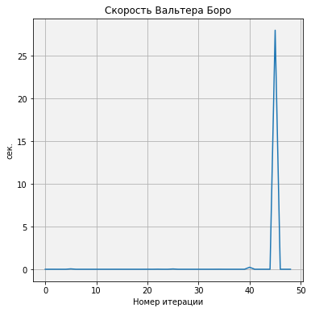


Дело в том, что мы каждый раз проверяем число на простоту, а это в свою очередь разбор числа на делимости.  
Поэтому, как попадётся огромное простое число уходит много времени на обработку!


---  

В целом, я готов предоставить первые дружественные 42 пары (84 числа):

220,284,1184,1210,2620,2924,5020,5564,6232,6368,10744,10856,12285,14595,17296,18416,63020,76084,66928,66992,67095,71145,69615,87633,79750,88730,100485,124155,122265,139815,122368,123152,141664,153176,142310,168730,171856,176336,176272,180848,185368,203432,196724,202444,280540,365084,308620,389924,319550,430402,356408,399592,437456,455344,469028,486178,503056,514736,522405,525915,600392,669688,609928,686072,624184,691256,635624,712216,643336,652664,667964,783556,726104,796696,802725,863835,879712,901424,898216,980984,947835,1125765,998104,1043096


```python
seq=[220,284,1184,1210,2620,2924,5020,5564,6232,6368,10744,10856,12285,14595,17296,18416,63020,76084,66928,66992,67095,71145,69615,87633,79750,88730,100485,124155,122265,139815,122368,123152,141664,153176,142310,168730,171856,176336,176272,180848,185368,203432,196724,202444,280540,365084,308620,389924,319550,430402,356408,399592,437456,455344,469028,486178,503056,514736,522405,525915,600392,669688,609928,686072,624184,691256,635624,712216,643336,652664,667964,783556,726104,796696,802725,863835,879712,901424,898216,980984,947835,1125765,998104,1043096]
```

### Статистика

Узнаем сколько чётных и нечётных чисел в последовательности?  
Это также покажет, сколько чётных и нечётных пар!


```python
InteractiveShell.ast_node_interactivity = "last"

EvenAmicable=[i for i in seq if(i%2==0)]
len(EvenAmicable)
```


    68


```python
plt.pie([len(EvenAmicable),84-len(EvenAmicable)], 
        colors=["#A7FF5B","#E7AFFF"],
        labels=["Чётные","Нечётные"], 
        autopct='%1.1f%%',
        shadow=True,
        textprops={'color':"black"})
plt.legend([len(EvenAmicable),84-len(EvenAmicable)])
;
```


    ''


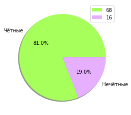


То есть 68 чисел из 84 - чётные.  
И 32 пары из 42 - чётные.

Исследуем теперь на простоту!


```python
PrimeAmicable=[i for i in seq if(_isPrime(i))]
plt.pie([len(PrimeAmicable),84-len(PrimeAmicable)], 
        colors=["#A7FF5B","#E7AFFF"],
        labels=["Составные","Простые"], 
        autopct='%1.1f%%',
        shadow=True,
        textprops={'color':"black"})
plt.legend([len(PrimeAmicable),84-len(PrimeAmicable)])
;
```


    ''


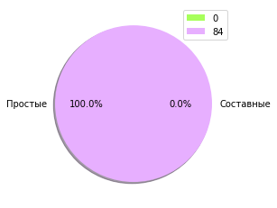


ШОК Контент! В первых 84 числах ни одно не является простым!

### Фракталы

В завершение моего доклада по дружественным числам, я бы хотел поиграться с самой интересной частью.  
Рисование фракталов.  

Хотя в текущем случае выйдет, что мы будем просто рисовать спирали согласну тому или иному углу последовательности


```python
ratio=[seq[i]/seq[i-1] for i in range(1,len(seq))]
```

В общем, я нашёл отношения чисел в первых 42 дружественных парах.  
Попробуем нарисовать два рисунка. Первый будет рисовать по среднему значению, а второй по мере перечисления списка отношений.  

Но вы можете спросить. Как знать насколько поворачивать в спирали? Угол просчитать очень просто.  
Мы берём число x. И узнаём угол по формуле angle=2pi/x^2

$ угол={{2 \pi }\over{x^2}} $


```python
np.mean(ratio)
```


    1.1533085895428854


Таким образом, мы знаем среднее отношение дружественных чисел в первых 42 парах.  
Значит угол равен:


```python
angle=sp.N(360/np.mean(ratio)**2)
angle
```


$\displaystyle 270.652128987702$


```python
#Создаём картинку 300х300

N=300
t = turtle.Turtle(fixed=False, width=N, height=N)
t.hideturtle()
t
```


    Turtle()


```python
for i in range(15):
    for j in range(int(angle)): 
        t.forward(i/10) 
        t.left(1)
        if(i>10):
            time.sleep(0.01) # Чтобы не терять рисунок
```

Получилось что-то типа розочки )))  
  
А теперь посмотрим на динамический угол!


```python
t = turtle.Turtle(fixed=False, width=N, height=N)
t.hideturtle()
t
```


    Turtle()


```python
for i in range(15):
    angle=sp.N(360/ratio[i]**2)
    for j in range(int(angle)): 
        t.forward(i/10) 
        t.left(1)
        if(i>10):
            time.sleep(0.04) # Чтобы не терять рисунок
```

В целом криво получается при динамике, но уже более менее красивый рисунок при среднем значении отношений дружественных чисел.   
Хотя мы представляем эти пары как друзей, так или иначе в древности они вызывали ассоциацию и с любовной парой. Поэтому, забавно, что рисунок спирали похож на розу.

### Подведём итог

Если говорить об открытых проблемах в математике дружественных чисел:  

Неизвестно, конечно или бесконечно количество пар дружественных чисел. На апрель 2016 года известно более 1 000 000 000 пар дружественных чисел. Все они состоят из чисел одинаковой чётности.  

Неизвестно, существует ли чётно-нечётная пара дружественных чисел.  

Также неизвестно, существуют ли взаимно простые дружественные числа, но если такая пара дружественных чисел существует, то их произведение должно быть больше 1067.

# Конец  

На этом всё, дорогие читатели!  
Надеюсь вам было интересно узнать что-то вроде такого из занимательной математики 😍

Ожидайте следующей статьи, в которой будет исследование компанейских чисел.
Если у вас есть мысли или пожелания, обязательно напишите...Может найду что подправить или добавить.

---

Здесь ссылка на датасеты дружественных чисел
[Дружественные числа](https://github.com/lonagi/pysasha/tree/master/datasets/Number%20Theory/Amicable%20Numbers)  

Датасет хранит 42 пары, а так есть отдельные, для последовательности из 84 чисел.

Если есть желание прочитать статью на другом источнике, то пожалуйста, вот ниже ссылки:
    
[ВКонтакте](vk.com/@lonagi-druzhestvennye-chisla-issledovanie)  
[Instagram](https://vk.com/lonagi)    
[Facebook](https://www.facebook.com/%D0%97%D0%B0%D0%BD%D0%B8%D0%BC%D0%B0%D1%82%D0%B5%D0%BB%D1%8C%D0%BD%D0%B0%D1%8F-%D0%BC%D0%B0%D1%82%D0%B5%D0%BC%D0%B0%D1%82%D0%B8%D0%BA%D0%B0-%D0%BE%D1%82-Lonagi-112410007105730)    
[Github](https://vk.com/lonagi)  


```python

```
