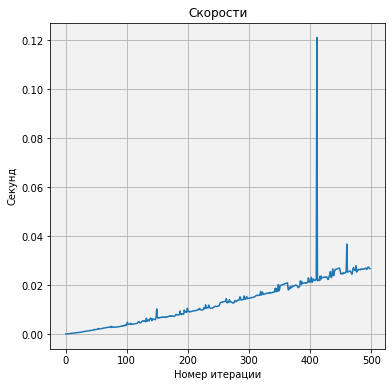
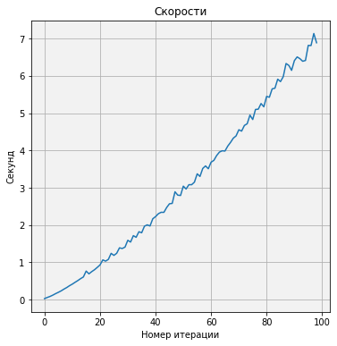
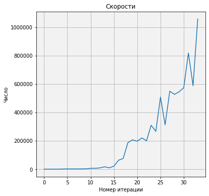
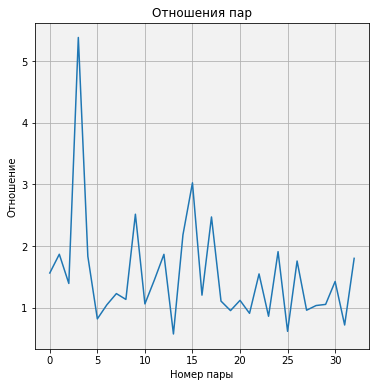
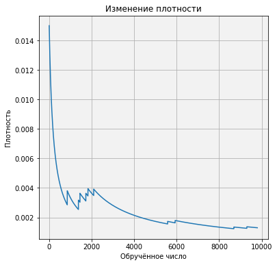
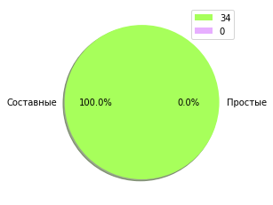

# Квази-дружественные числа. Исследование
(или просто Обручённые числа)
### #Занимательная Математика
#### Весь код на Github, ссылка в конце статьи!
Импорт библиотек


```python
from IPython.display import Image
from IPython.core.display import HTML 
from IPython.core.interactiveshell import InteractiveShell
from scipy.ndimage.filters import gaussian_filter1d
from scipy.signal import savgol_filter
import numpy as np
import sympy as sp
import pandas as pd
import random as r
import time
import matplotlib.pyplot as plt
import ipyturtle as turtle
#InteractiveShell.ast_node_interactivity = "all"

def drawPlot(ss,title="Скорости",y="Секунд",x="Номер итерации"):
    fig,ax=plt.subplots(figsize=(6,6))
    ax.set_facecolor("#F2F2F2")
    ax.grid()
    ax.set_title(title)
    ax.set_ylabel(y)
    ax.set_xlabel(x)
    ax.plot(ss)
```


```python
Image(url="https://sun9-27.userapi.com/5E-SgBD3vzq5A09aJ8lFJdeE-QVpBu397j9ZKg/pX1kJXlBs_E.jpg", width=400)
```


Квази-дружественные числа это два положительных целых числа, для которых сумма собственных делителей каждого числа на 1 больше, чем второе число. 

Вот так вот они стоят рядом ☺  

Не имеют большого значения для теории чисел, однако являются интересным элементом занимательной математики. Что и есть интересно для нас :)


```python
def Divisors(num): 
    from math import sqrt as mmsq
    s=set([1])
    i=1
    a=int(mmsq(num)+1)
    while i<=a: 
        if(num//i==num):
            i+=1
            continue
        if (num%i==0): 
            if (num//i!=i): 
                s.add(num//i)
            s.add(i)
        i+=1
    return s
```


```python
Divisors(48)," #Делители числа 48"
Divisors(78)," #Делители числа 75"
```


    ({1, 2, 3, 6, 13, 26, 39}, ' #Делители числа 75')


```python
sum(Divisors(48))
sum(Divisors(75))
```


    49


И что мы наблюдаем? Сумма собственных делителей у 48 выдало нам 76, что на единицу больше, чем 75. А у 75 сумма выдала 49. Вот и элементарный пример!)

И этот пример является первым представителем пар в множестве обручённых чисел!

## Факты

1) Все известные пары обручённых чисел имеют противоположную чётность.  

2) Неизвестно, конечно или бесконечно количество пар обручённых чисел.  

## Алгоритмы 

Первый алгоритм, который я решил сделать, это когда мы используем метод перебора. Простой брут форс.


```python
##Brute force Method
def BetrothedNumber(k,ratio=5.5,ratio2=5.5,order=1,returni=False):  
    ##All divisors for all numbers
    allDels=dict()
    
    ###Second number is greater than first number
    from itertools import chain
    concatenated = chain( range(k, int(k*ratio)+1 ),range(k, int(k/ratio2)+1 ,-1) )
    for i in concatenated:

        ###We don't want repeat operations
        ###Therefore search and save all divisors
        if(str(i) not in allDels):
            allDels[str(i)] = Divisors(i)

        ###Sum1+order_num = 2nd Num and Sum2+order_num = 1st Nub
        if(i != k and sum(allDels[str(i)]) == k+order and sum(allDels[str(k)]) == i+order):
            if(returni):
                return (k,i)
            else:
                print(k,"->",i)
```

Особенность этого метода в том, что мы берём по порядку натуральное число, а затем в выбранном диапазоне перебираем числа в качестве пары.    
  
Каким образом я выбрал диапазон?  

Позже ещё расскажу


```python
BetrothedNumber(1) # Ничего
BetrothedNumber(48) # Нашли пару!
```

    48 -> 75


Рассчитаем скорость выполнения данного алгоритма


```python
%time BetrothedNumber(48)
```

    48 -> 75
    CPU times: user 1.49 ms, sys: 929 µs, total: 2.42 ms
    Wall time: 2.3 ms


```python
%%timeit BetrothedNumber(48)
;
```

    48 -> 75
    48 -> 75
    48 -> 75
    48 -> 75
    48 -> 75
    48 -> 75
    48 -> 75
    48 -> 75
    48 -> 75
    48 -> 75
    48 -> 75
    48 -> 75
    48 -> 75
    48 -> 75
    48 -> 75
    48 -> 75
    9.05 ns ± 0.146 ns per loop (mean ± std. dev. of 7 runs, 100000000 loops each)


Такие вышли показатели для числа 48. Позже мы сравним с другим методом.   

Но можно также, построить график, чтобы узнать скорость


```python
s = np.array([])
for i in range(1,500):
    start_time = time.time()
    BetrothedNumber(i)
    end_time = (time.time() - start_time)
    s=np.append(s,end_time)
```

    48 -> 75
    75 -> 48
    140 -> 195
    195 -> 140


```python
drawPlot(s)
```





Изначально я думал, что это алгоритм O(n), но он не так сильно усложняется со временем. Хотя смущает, что если мы нашли пару, то оно задерживается намного сильнее.

Попробуем другой метод. Это тоже типо перебора, но здесь функция f(m,n), где мы подаём на вход два числа на проверку "квази-дружбы".


```python
def BetrothedNumbers(m,n,order=1):
    if(m!=n):
        s1=set([1])
        for i in range(int(m/2+1),1,-1):
            if(m%i==0):
                s1.add(i)
        s2=set([1])
        for i in range(int(n/2+1),1,-1):
            if(n%i==0):
                s2.add(i)
        return sum(s1)==n+1 and sum(s2)+n==sum(s1)+m
    else:
        return False
```


```python
BetrothedNumbers(48,75)
```


    True


```python
%time BetrothedNumbers(48,75)
```

    CPU times: user 45 µs, sys: 0 ns, total: 45 µs
    Wall time: 60.1 µs


    True


```python
%%timeit
BetrothedNumbers(48,75)
```

    6.62 µs ± 40.6 ns per loop (mean ± std. dev. of 7 runs, 100000 loops each)


```python
s = np.array([])
for i in range(1,100):
    start_time = time.time()
    for j in range(1,100):
        BetrothedNumber(i,j)
    end_time = (time.time() - start_time)
    s=np.append(s,end_time)
```

    48 -> 75
    75 -> 48


```python
drawPlot(s)
```



Вот такие параметры выдал второй алгоритм. По этой причине, я выбираю первый брут форс!  

Если не понятно, то этот алгоритм дольше работает больше чем в 10 раз.

Кстати, sympy снова нас подвёл. У него нет алгоритмов для квази-дружественных чисел, но зато я нашёл ещё алгоритм в Интернете. Попробуем разузнать, что с ним. 


```python
def NBetrothedNumbers(n) :
    bet=[]
    for num1 in range (1,n) : 
        sum1 = 1
        i = 2
        while i * i <= num1 : 
            if (num1 % i == 0) : 
                sum1 = sum1 + i 
                if (i * i != num1) : 
                    sum1 += num1 / i 
            i =i + 1
        if (sum1 > num1) : 
            num2 = sum1 - 1
            sum2 = 1
            j = 2
            while j * j <= num2 : 
                if (num2 % j == 0) : 
                    sum2 += j 
                    if (j * j != num2) : 
                        sum2 += num2 / j 
                j = j + 1
            if (sum2 == num1+1) : 
                bet.append ((num1,num2)) 
    return bet
n = 1000000
bet=NBetrothedNumbers(n) 
bet
```

    [(48, 75.0),
     (140, 195.0),
     (1050, 1925.0),
     (1575, 1648.0),
     (2024, 2295.0),
     (5775, 6128.0),
     (8892, 16587.0),
     (9504, 20735.0),
     (62744, 75495.0),
     (186615, 206504.0),
     (196664, 219975.0),
     (199760, 309135.0),
     (266000, 507759.0),
     (312620, 549219.0),
     (526575, 544784.0),
     (573560, 817479.0),
     (587460, 1057595.0)]

А он довольно быстрый! Быстрее, чем я мог написать!  
Данная функция на вход принимает значение, до которого мы будем собирать пары

Теперь мы можем ряд пар превратить в последовательный ряд чисел.


```python
flat_list = [item for sublist in bet for item in sublist]
flat_list
```


    [48,
     75.0,
     140,
     195.0,
     1050,
     1925.0,
     1575,
     1648.0,
     2024,
     2295.0,
     5775,
     6128.0,
     8892,
     16587.0,
     9504,
     20735.0,
     62744,
     75495.0,
     186615,
     206504.0,
     196664,
     219975.0,
     199760,
     309135.0,
     266000,
     507759.0,
     312620,
     549219.0,
     526575,
     544784.0,
     573560,
     817479.0,
     587460,
     1057595.0]

Теперь покажу, почему стоит рассматривать следующие 5x чисел в диапазоне брутфорса.  

```python
df=pd.DataFrame([(48, 75.0), (140, 195.0), (1050, 1925.0), (1575, 1648.0), (2024, 2295.0), (5775, 6128.0), (8892, 16587.0), (9504, 20735.0), (62744, 75495.0), (186615, 206504.0), (196664, 219975.0), (199760, 309135.0), (266000, 507759.0), (312620, 549219.0), (526575, 544784.0), (573560, 817479.0), (587460, 1057595.0)])
df
```

<div>
<style scoped>
    .dataframe tbody tr th:only-of-type {
        vertical-align: middle;
    }

    .dataframe tbody tr th {
        vertical-align: top;
    }

    .dataframe thead th {
        text-align: right;
    }
</style>
<table border="1" class="dataframe">
  <thead>
    <tr style="text-align: right;">
      <th></th>
      <th>0</th>
      <th>1</th>
    </tr>
  </thead>
  <tbody>
    <tr>
      <th>0</th>
      <td>48</td>
      <td>75.0</td>
    </tr>
    <tr>
      <th>1</th>
      <td>140</td>
      <td>195.0</td>
    </tr>
    <tr>
      <th>2</th>
      <td>1050</td>
      <td>1925.0</td>
    </tr>
    <tr>
      <th>3</th>
      <td>1575</td>
      <td>1648.0</td>
    </tr>
    <tr>
      <th>4</th>
      <td>2024</td>
      <td>2295.0</td>
    </tr>
    <tr>
      <th>5</th>
      <td>5775</td>
      <td>6128.0</td>
    </tr>
    <tr>
      <th>6</th>
      <td>8892</td>
      <td>16587.0</td>
    </tr>
    <tr>
      <th>7</th>
      <td>9504</td>
      <td>20735.0</td>
    </tr>
    <tr>
      <th>8</th>
      <td>62744</td>
      <td>75495.0</td>
    </tr>
    <tr>
      <th>9</th>
      <td>186615</td>
      <td>206504.0</td>
    </tr>
    <tr>
      <th>10</th>
      <td>196664</td>
      <td>219975.0</td>
    </tr>
    <tr>
      <th>11</th>
      <td>199760</td>
      <td>309135.0</td>
    </tr>
    <tr>
      <th>12</th>
      <td>266000</td>
      <td>507759.0</td>
    </tr>
    <tr>
      <th>13</th>
      <td>312620</td>
      <td>549219.0</td>
    </tr>
    <tr>
      <th>14</th>
      <td>526575</td>
      <td>544784.0</td>
    </tr>
    <tr>
      <th>15</th>
      <td>573560</td>
      <td>817479.0</td>
    </tr>
    <tr>
      <th>16</th>
      <td>587460</td>
      <td>1057595.0</td>
    </tr>
  </tbody>
</table>
</div>


Итого я смог построить почти за 2 минуты 16 пар!

Построим график того, как находится квази-друг по мере увеличениея входного значения в функцию.


```python
drawPlot(flat_list,y="Число")
```





Попробуем посмотреть на таких данных какая будет скорость графика.


```python
dbet = [flat_list[i]-flat_list[i-1] for i in range(1,len(flat_list))]
drawPlot(dbet,title="Скорость обрученных чисел",x="Номер числа",y="Ускорение")
```


Кстати, а по поводу отношений в 5.5 раз. Можем попробовать найти отношения среди этих 7 пар. Может есть сходимость?


```python
ratio=[flat_list[i]/flat_list[i-1] for i in range(1,len(flat_list))]
drawPlot(ratio,title="Отношения пар",x="Номер пары",y="Отношение")
```





И вот мы видим два момента.  
Первый: ряд не сходится

Второй: если взять любое обручённое число и умножать его на любые числа до 5.5, то мы точно сможем найти его пару! Поэтому и получился своего рода диапазон.


```python

```

Узнаем среднее отношение


```python
np.mean(ratio)
```


    1.5267131382431978


#### Плотность   
По традиции, изучим плотность ряда квази-дружественных чисел!  
А затем и скорость.


```python
densities=[(len(list(filter(lambda x: x < i, sorted(flat_list))))-1)/i for i in range(200,10000)]
drawPlot(densities,"Изменение плотности","Плотность","Обручённое число")
```





Ого. Плотность стремительно идёт к нулю


```python
ddensities = [densities[i]-densities[i-1] for i in range(1,len(densities))]
drawPlot(ddensities,title="Скорость плотности",x="Обручённое число",y="Скорсоть")
```


Кстати, а теперь если приглядется на линии, которые появились на графике скорости плотности, то мы поймём, что это точки перегиба!  

В целом, я бы сделал вывод, что раз плотность уменьшается, то находить обрученные числа с их ростом становится легче, если пренебречь тем, что числа большие.

### Статистика

Узнаем сколько чётных и нечётных чисел в последовательности?


```python
InteractiveShell.ast_node_interactivity = "last"

EvenBetrothed=[i for i in flat_list if(i%2==0)]
len(EvenBetrothed)
```


    17


```python
plt.pie([len(EvenBetrothed),34-len(EvenBetrothed)], 
        colors=["#A7FF5B","#E7AFFF"],
        labels=["Чётные","Нечётные"], 
        autopct='%1.1f%%',
        shadow=True,
        textprops={'color':"black"})
plt.legend([len(EvenBetrothed),34-len(EvenBetrothed)])
;
```


    ''


Идеальный баланс!

Исследуем теперь на простоту!


```python
def _isPrime(n):
    if n%2==0:
        return n==2
    d=3
    while d*d<=n and n%d!=0:
        d+=2
    return d*d>n
```


```python
PrimeBetrothed=[(i) for i in flat_list if(_isPrime(int(i)))]
plt.pie([34-len(PrimeBetrothed),len(PrimeBetrothed)], 
        colors=["#A7FF5B","#E7AFFF"],
        labels=["Составные","Простые"], 
        autopct='%1.1f%%',
        shadow=True,
        textprops={'color':"black"})
plt.legend([34-len(PrimeBetrothed),len(PrimeBetrothed)])
;
```

    ''




Ни одного простого числа! Вот так забава.

### Фракталы

Посмотрим, а можно ли нарисовать какие-то картинки по данному ряду?


```python
ratio=[flat_list[i]/flat_list[i-1] for i in range(1,len(flat_list))]
```

$ угол={{2 \pi }\over{x^2}} $


```python
np.mean(ratio)
```

    1.5267131382431978


```python
angle=sp.N(360/np.mean(ratio)**2)
angle
```

$\displaystyle 154.449894093916$

```python
#Создаём картинку 300х300

N=300
t = turtle.Turtle(fixed=False, width=N, height=N)
t.hideturtle()
t
```

    Turtle()


```python
for i in range(15):
    for j in range(int(angle)): 
        t.forward(i/10) 
        t.left(1)
        if(i>10):
            time.sleep(0.01) # Чтобы не терять рисунок
```

```python
t = turtle.Turtle(fixed=False, width=N, height=N)
t.hideturtle()
t
```

    Turtle()


```python
for i in range(15):
    angle=sp.N(360/ratio[i]**2)
    for j in range(int(angle)): 
        t.forward(i/10) 
        t.left(1)
        if(i>10):
            time.sleep(0.04) # Чтобы не терять рисунок
```

Если взять среднее соотношение чисел, то получается что-то типо рисунка компанейских чисел. (Не зря, существуют квази-компанейские числа)

Но, как только у нас будет динамический угол, то получается расширенная версия дружественных чисел. Вроде и странная, а вроде и больше похожа на Google Chrome, чем было.

### Подведём итог

Квази-дружественные (обрученные) числа имеют очень много похожих свойств с компанейскими и дружественными числами. И это удивляет. 

# Конец  

На этом всё, дорогие читатели!  
Надеюсь вам было интересно узнать что-то вроде такого из занимательной математики 😍

Прошлый раз я обещал расказать про совершенные числа, но у меня не хватает времени пока, что. Поэтому я успел сделать такую статью)
Если у вас есть мысли или пожелания, обязательно напишите...Может найду что подправить или добавить.